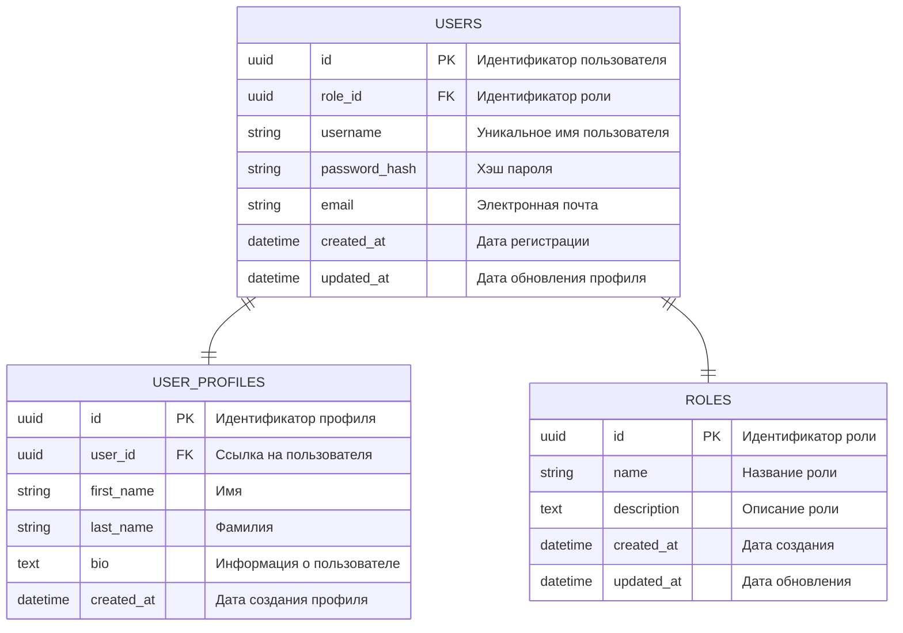
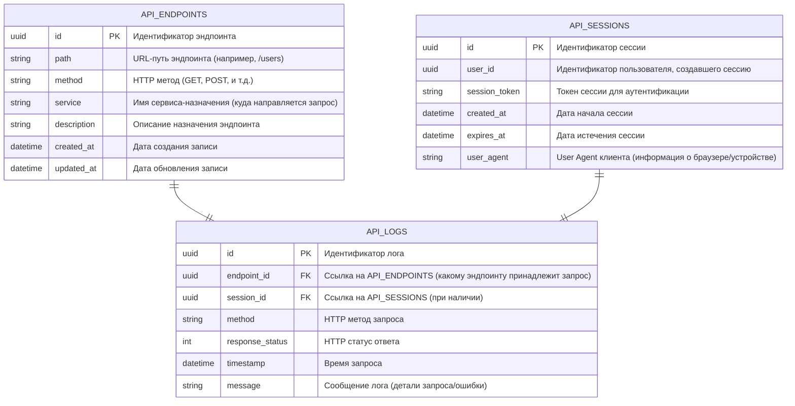

# Документация

## Общая архитектура

Архитектура проекта на контекстном уровне сгенерированная при помощи likec4:

Исходный код для диаграммы находится в файле [architecture.c4](architecture.c4). Посмотреть архитектуру проекта на уровне контейнеров можно использовав код из файла.

## Таблицы для сервисов

### Сервис пользователей

### Сервис событий

### Сервис статистики

### Сервис маршрутизации запросов

