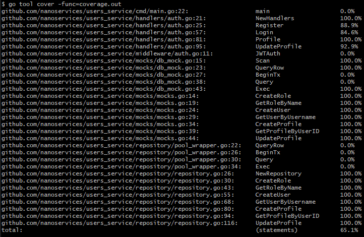

# User Service

Написан на Go, использует базу данных Postgres.

## Зона ответственности

- Регистрация и аутентификация пользователей.
- Хранение информации о пользователях и их ролях.
- Предоставление информации о пользователях другим сервисам по запросу.

## Границы сервиса

- Обеспечивает REST API для операций с пользователями.
- Использует собственную базу данных PostgreSQL для хранения данных.
- Отделён от логики других сервисов: API Gateway обращается к User Service через HTTP.

## Спецификация

Доступна в файле [openapi.yaml](./users_service/openapi.yaml).

## Тестирование

Покрытие юнит тестами, больше 60%:

Покрыта вся бизнес логика, не покрыты только [main.go](./cmd/main.go) и [auth.go](./middleware/auth.go) и заглушки.

## Примеры запросов

### Регистрация

    curl -X POST http://localhost:8080/register \
    -H "Content-Type: application/json" \
    -d '{"username": "testuser", "password": "password123", "email": "test@example.com"}'

### Аутентификация

    curl -X POST http://localhost:8080/login \
    -H "Content-Type: application/json" \
    -d '{"username": "testuser", "password": "password123"}'

### Просмотр профиля

    curl -X GET http://localhost:8080/profile \
    -H "Authorization: Bearer <token>"

### Изменение профиля

    curl -X POST http://localhost:8080/profile \
    -H "Authorization: Bearer <token>" \
    -H "Content-Type: application/json" \
    -d '{
    "first_name": "Amir",
    "phone_number": "+1234567890"
    }'
